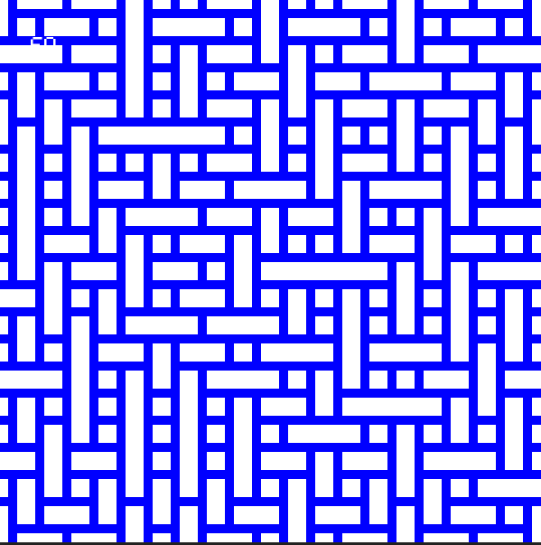
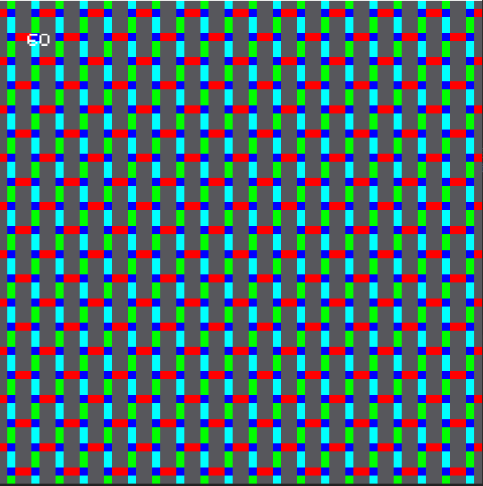

# Wave Function Collapse
### and intriguing way to create a repetive pattern totally inspired by [this](https://www.youtube.com/watch?v=rI_y2GAlQFM&t=2185s) video
    It can generate patterns like these:
    
    

